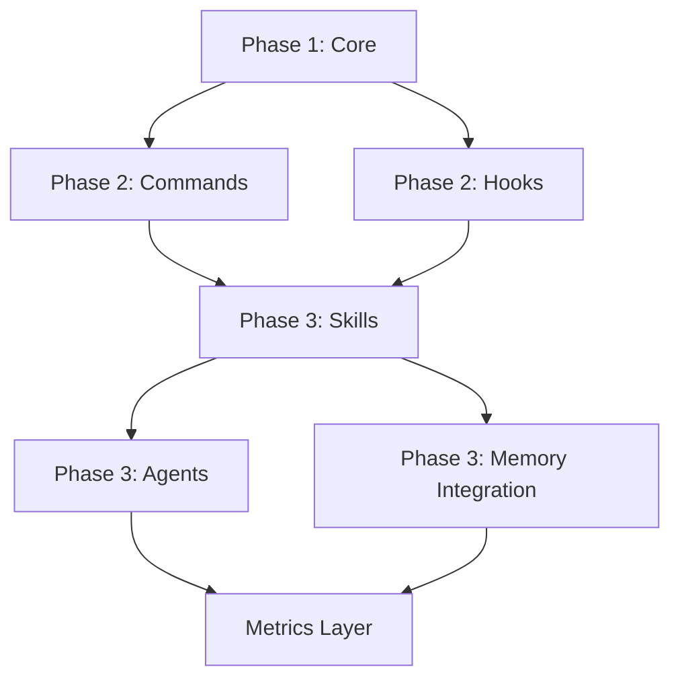

# dev-stack v9.0.0 Hybrid Architecture Design

**Status:** ✅ APPROVED
**Date:** 2026-03-01
**Author:** orchestrator + domain-analyst

---

## 🎯 Overview

**Architecture:** Hybrid (Smart Router + Mixed Modules)
**Tools Coverage:** 145/145 (100%)
**Focus:** Quality + Speed + Efficiency (Balanced)
**Implementation:** Prioritized (Optimized)

---

## 📐 Architecture Design

```
┌─────────────────────────────────────────────────────────────────────────┐
│                        dev-stack v9.0.0 HYBRID                          │
├─────────────────────────────────────────────────────────────────────────┤
│                                                                         │
│  ┌─────────────────────────────────────────────────────────────────┐   │
│  │                    🎯 SMART ROUTER (Layered)                    │   │
│  │  ┌─────────────┐  ┌─────────────┐  ┌─────────────────────────┐  │   │
│  │  │ Classifier  │→ │ Workflow    │→ │ Team Assembler          │  │   │
│  │  │ (AI+Rules)  │  │ Selector    │  │ (Dependency Graph)      │  │   │
│  │  └─────────────┘  └─────────────┘  └─────────────────────────┘  │   │
│  └─────────────────────────────────────────────────────────────────┘   │
│                                    │                                    │
│  ┌─────────────────────────────────┼─────────────────────────────────┐ │
│  │                         MODULE LAYER (Hybrid)                     │ │
│  ├─────────────────┬───────────────┴───────────────┬─────────────────┤ │
│  │                 │                               │                 │ │
│  │  ┌───────────┐  │  ┌───────────────────────┐   │  ┌───────────┐  │ │
│  │  │  CODE     │  │  │     KNOWLEDGE         │   │  │   DOCS    │  │ │
│  │  │  (Mesh)   │  │  │     (Layered)         │   │  │ (Modular) │  │ │
│  │  ├───────────┤  │  ├───────────────────────┤   │  ├───────────┤  │ │
│  │  │ serena(26)│  │  │ memory(9)             │   │  │doc-forge  │  │ │
│  │  │ LSP(8)    │  │  │ sequentialthinking(1) │   │  │(16)       │  │ │
│  │  │ superpowers│ │  │ context7(2)           │   │  │fetch(3)   │  │ │
│  │  │ lib-router │ │  │ lib-intelligence      │   │  │web_reader │  │ │
│  │  │ lib-tdd   │  │  │                       │   │  │filesystem │  │ │
│  │  │ lib-testing│ │  │                       │   │  │(15)       │  │ │
│  │  └───────────┘  │  └───────────────────────┘   │  └───────────┘  │ │
│  │                 │                               │                 │ │
│  └─────────────────┴───────────────────────────────┴─────────────────┘ │
│                                                                         │
│  ┌─────────────────────────────────────────────────────────────────┐   │
│  │                      🪝 HOOKS LAYER                              │   │
│  │  SessionStart → PreCommit → PreToolUse → PostToolUse → Notify   │   │
│  └─────────────────────────────────────────────────────────────────┘   │
│                                                                         │
│  ┌─────────────────────────────────────────────────────────────────┐   │
│  │                      📊 METRICS LAYER                            │   │
│  │  Performance │ Quality Score │ Tool Usage │ Success Rate        │   │
│  └─────────────────────────────────────────────────────────────────┘   │
│                                                                         │
└─────────────────────────────────────────────────────────────────────────┘
```

---

## 📦 Module Design

### Module 1: CODE (Mesh Architecture)

**Philosophy:** Any tool can call any tool within the module for maximum flexibility.

**Tools:**
- serena (26): Symbol-aware operations
- LSP (8): Multi-language support
- superpowers: TDD, debugging, brainstorming
- lib-router: Tool routing
- lib-tdd: Test-driven development
- lib-testing: Test strategies (NEW)

**Integration Points:**
```yaml
Code Navigation:
  primary: serena:find_symbol
  fallbacks: [serena:get_symbols_overview, Read]

Code Editing:
  primary: serena:replace_symbol_body
  fallbacks: [serena:insert_after_symbol, serena:insert_before_symbol, Edit]

Code References:
  primary: serena:find_referencing_symbols
  fallbacks: [Grep]

Pattern Search:
  primary: serena:search_for_pattern
  fallbacks: [Grep]
```

### Module 2: KNOWLEDGE (Layered Architecture)

**Philosophy:** Clear abstraction layers for storage, retrieval, and reasoning.

**Tools:**
- memory (9): Knowledge graph
- sequentialthinking (1): Step-by-step reasoning
- context7 (2): Library documentation
- lib-intelligence: Snapshot, drift, impact

**Layer Structure:**
```yaml
Layer 1 - Storage:
  - memory:create_entities
  - memory:create_relations
  - memory:add_observations

Layer 2 - Retrieval:
  - memory:search_nodes
  - memory:read_graph
  - memory:open_nodes

Layer 3 - Reasoning:
  - sequentialthinking:sequentialthinking
  - serena:think_about_collected_information
  - serena:think_about_task_adherence
  - serena:think_about_whether_you_are_done

Layer 4 - Documentation:
  - context7:resolve-library-id
  - context7:query-docs
```

### Module 3: DOCS (Modular Architecture)

**Philosophy:** Independent modules with clear boundaries.

**Tools:**
- doc-forge (16): Document processing
- fetch (1): URL fetching
- web_reader (1): Web to markdown
- filesystem (15): File operations

**Module Structure:**
```yaml
Document Reader Module:
  - doc-forge:document_reader
  - doc-forge:excel_read

Converter Module:
  - doc-forge:docx_to_html
  - doc-forge:docx_to_pdf
  - doc-forge:html_to_markdown
  - doc-forge:html_to_text
  - doc-forge:format_convert

PDF Module:
  - doc-forge:pdf_merger
  - doc-forge:pdf_splitter

Text Module:
  - doc-forge:text_formatter
  - doc-forge:text_splitter
  - doc-forge:text_diff
  - doc-forge:text_encoding_converter

HTML Module:
  - doc-forge:html_cleaner
  - doc-forge:html_formatter
  - doc-forge:html_extract_resources

Web Module:
  - fetch:fetch
  - web_reader:webReader

File Module:
  - filesystem:create_directory
  - filesystem:directory_tree
  - filesystem:list_directory
  - filesystem:read_text_file
  - filesystem:write_file
  - filesystem:move_file
  - filesystem:search_files
```

---

## 🆕 New Components

### 1. `:init` Command

**Purpose:** Initialize dev-stack for any project with auto-detection.

**File:** `plugins/dev-stack/commands/init.md`

**Flow:**
1. Check if already initialized
2. Detect languages (tsconfig.json, pyproject.toml, go.mod, etc.)
3. Run serena:onboarding
4. Analyze codebase structure
5. Detect patterns (Service, Repository, Controller, etc.)
6. Create constitution.md
7. Store in memory MCP
8. Generate project report

**Tools Used:**
- serena:check_onboarding_performed
- serena:onboarding
- filesystem:directory_tree
- serena:search_for_pattern
- serena:get_symbols_overview
- serena:write_memory
- memory:create_entities
- filesystem:create_directory

### 2. PreCommit Hook

**Purpose:** Quality gate before git commit.

**File:** `plugins/dev-stack/hooks/scripts/pre-commit.sh`

**Checks:**
1. Lint (auto-detect: npm run lint, ruff, golint)
2. Type check (tsc, mypy, go build)
3. Tests (npm test, pytest, go test)
4. Security patterns (hardcoded passwords, API keys, eval)

**Exit:** Block commit if any check fails.

### 3. lib-testing Skill

**Purpose:** Test strategies and validation.

**File:** `plugins/dev-stack/skills/lib-testing/SKILL.md`

**Capabilities:**
- Test framework detection (jest, pytest, go test, etc.)
- Test discovery (find test files)
- TDD workflow integration
- Coverage validation
- Test generation from BDD scenarios

**Tools Used:**
- serena:find_file
- serena:search_for_pattern
- superpowers:test-driven-development
- Bash

### 4. data-engineer Agent

**Purpose:** Database and data pipeline specialist.

**File:** `plugins/dev-stack/agents/data-engineer.md`

**Responsibilities:**
- Schema design
- Migration scripts
- Data validation
- Query optimization
- ETL pipelines

**Tools Used:**
- serena:search_for_pattern
- serena:find_symbol
- filesystem:directory_tree
- Read, Write, Bash

### 5. Enhanced lib-router

**Purpose:** AI-optimized tool routing with fallback chains.

**File:** `plugins/dev-stack/skills/lib-router/SKILL.md`

**Intents (12):**
```yaml
code_read: [serena:find_symbol, serena:get_symbols_overview, Read]
code_edit: [serena:replace_symbol_body, serena:insert_after_symbol, Edit]
code_refs: [serena:find_referencing_symbols, Grep]
code_overview: [serena:get_symbols_overview, Read]
file_find: [serena:find_file, filesystem:search_files, Glob]
dir_list: [serena:list_dir, filesystem:list_directory, Bash:ls]
dir_tree: [filesystem:directory_tree, Bash:find]
doc_fetch: [context7:query-docs, web_reader:webReader, fetch:fetch]
doc_read: [doc-forge:document_reader, Read]
memory_write: [memory:create_entities, serena:write_memory]
memory_read: [memory:search_nodes, memory:read_graph, serena:read_memory]
think: [sequentialthinking:sequentialthinking, serena:think_about_*]
```

### 6. Enhanced Quality Gates

**Purpose:** Serena-powered quality checks.

**Integration:** quality-gatekeeper agent

**New Checks:**
```yaml
Before APPROVED:
  1. serena:think_about_collected_information:
     "Have I reviewed all modified files?"
  2. serena:think_about_task_adherence:
     "Does implementation match spec?"
  3. serena:think_about_whether_you_are_done:
     "Are all acceptance criteria met?"
```

### 7. Metrics Layer

**Purpose:** Track performance, quality, and tool usage.

**Metrics Collected:**
```yaml
Performance:
  - task_completion_time
  - tool_call_count
  - cache_hit_rate
  - parallel_efficiency

Quality:
  - gate_pass_rate
  - test_coverage
  - security_scan_results
  - code_complexity

Tool Usage:
  - tools_per_workflow
  - fallback_usage
  - mcp_response_time
  - skill_frequency

Success:
  - first_time_success_rate
  - rework_rate
  - user_satisfaction
```

---

## 📋 Implementation Phases

### Phase 1: Core (Day 1-2) - HIGH impact, LOW effort

| Task | File | Impact | Effort |
|------|------|--------|--------|
| Enhance orchestrator | agents/orchestrator.md | HIGH | 30 min |
| Enhance quality-gatekeeper | agents/quality-gatekeeper.md | HIGH | 30 min |
| Rewrite lib-router | skills/lib-router/SKILL.md | HIGH | 1 hr |
| Add memory-sync reference | skills/lib-intelligence/references/memory-sync.md | MEDIUM | 30 min |

### Phase 2: Commands + Hooks (Day 3-4) - HIGH impact, MEDIUM effort

| Task | File | Impact | Effort |
|------|------|--------|--------|
| Create :init command | commands/init.md | HIGH | 2 hr |
| Add PreCommit hook | hooks/hooks.json | HIGH | 30 min |
| Create pre-commit.sh | hooks/scripts/pre-commit.sh | HIGH | 1 hr |

### Phase 3: Skills + Agents (Day 5-7) - MEDIUM impact, MEDIUM effort

| Task | File | Impact | Effort |
|------|------|--------|--------|
| Create lib-testing skill | skills/lib-testing/SKILL.md | MEDIUM | 2 hr |
| Create data-engineer agent | agents/data-engineer.md | MEDIUM | 1 hr |
| Update all agents for memory | agents/*.md | MEDIUM | 2 hr |
| Create metrics collector | hooks/scripts/metrics.sh | LOW | 1 hr |

---

## ✅ Success Criteria

| Metric | v8.0.0 | v9.0.0 Target | Measurement |
|--------|--------|---------------|-------------|
| Tool Coverage | 30% | 100% | Tools used / 145 |
| serena Usage | 40% | 100% | serena tools / 26 |
| memory MCP | 0% | 100% | memory tools / 9 |
| doc-forge | 0% | 80% | doc-forge tools / 16 |
| filesystem | 30% | 70% | filesystem tools / 15 |
| context7 | 50% | 100% | context7 tools / 2 |
| Hooks | 5 | 6 | +PreCommit |
| Commands | 11 | 12 | +:init |
| Skills | 6 | 7 | +lib-testing |
| Agents | 11 | 12 | +data-engineer |

---

## 🔄 Dependencies



---

## 📝 Notes

- All changes are backward compatible with v8.0.0
- No external integrations required (all tools already installed)
- Focus on leveraging existing 145 tools to maximum capacity
- Prioritized implementation ensures high-impact changes first

---

*Design approved: 2026-03-01*
*Ready for implementation plan generation*
